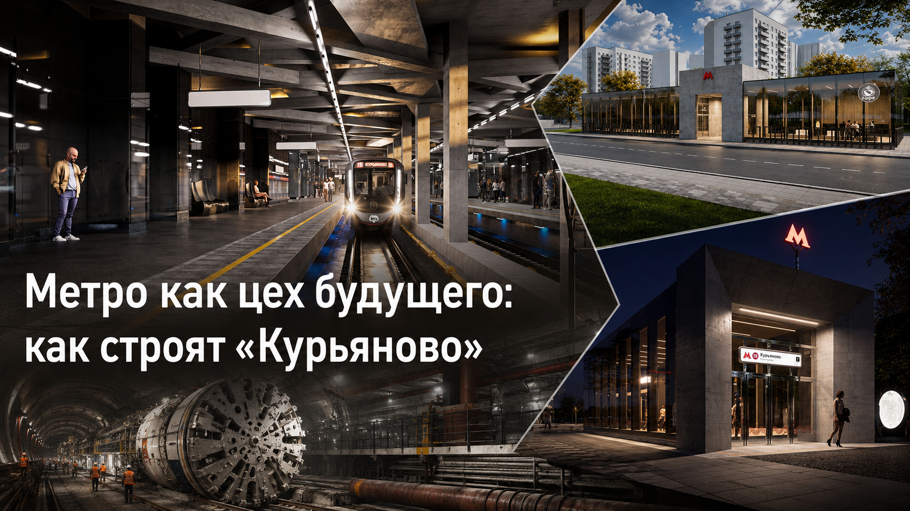
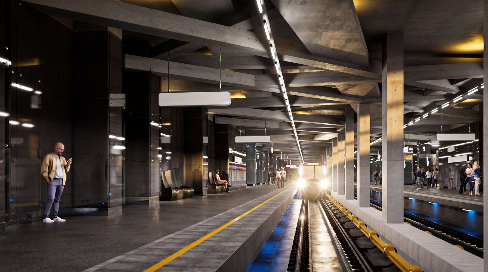
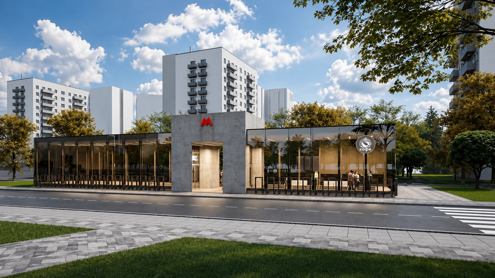
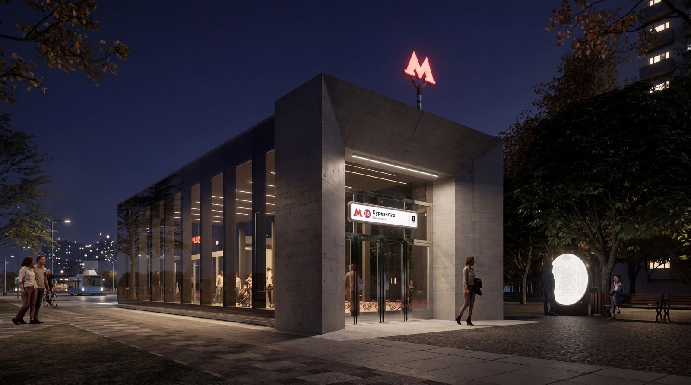
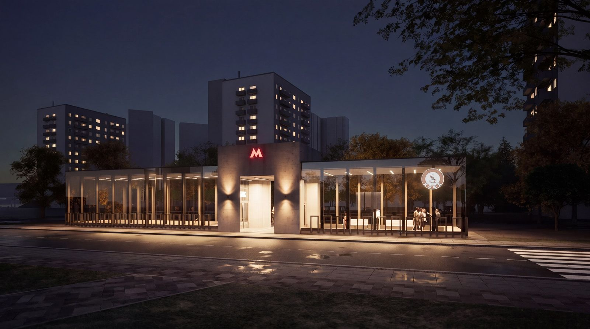

# Метро как цех будущего: как строят «Курьяново» — от форшахты до световых балок
 


*Художественный нейро-арт коллаж.*

В московском метро глаз по привычке ищет мрамор, мозаику, цветной камень. На станции «Курьяново» логика будет иной: архитекторы не собираются прятать конструкцию под нарядной оболочкой. Саму конструкцию и сделают главным зрелищем.

Железобетон здесь не фон. Он задаёт станции характер — тяжёлый, рельефный, нарочито индустриальный. Над платформами протянется сложная сетка балок, между путями встанут прямоугольные колонны. Серую массу прорежут длинные световые линии. Почти чертёж, только в натуральную величину.

Но рендер — ещё не рабочая документация. Он показывает замысел, а не марку бетона, шаг арматуры, схему креплений или мощность каждого светильника. Поэтому разберём «Курьяново» по-инженерному: отделим опубликованные характеристики от нормативных ориентиров, а красивые поверхности — от конструкций, которые будут держать грунт, воду, вибрацию и ежедневный пассажирский поток.

Станцию строят в Печатниках, рядом с Курьяновской поймой, Москвой-рекой и одним из крупнейших коммунальных комплексов столицы. Здесь индустриальная тема не придумана ради эффектной презентации. Она выросла из самого места.

> **Главная мысль проекта:** «Курьяново» должно выглядеть как современная инженерная машина, но работать обязано безопасно и тихо. Пассажир не должен разгадывать пространство — оно обязано быть понятным.

## Технический паспорт: что уже известно

| Параметр | Опубликованные данные |
|---|---|
| Линия | Бирюлёвская, номер 18, рубиновый цвет на схеме |
| Положение | Между Батюнинским проездом и Проектируемым проездом № 5112, в районе примыкания 4-й Курьяновской улицы к Батюнинской улице |
| Первый пусковой участок | «ЗИЛ» — «Курьяново», 8,65 км, четыре станции |
| Плановый срок первого участка | 2028 год |
| Тип платформ | Две береговые платформы: пути проходят посередине, посадочные зоны находятся по краям общего станционного объёма |
| Перегон к «Кленовому бульвару» | Два однопутных тоннеля длиной около 1130 м каждый до переходной камеры |
| Участок от переходной камеры к станции | Один двухпутный тоннель длиной свыше 850 м |
| Текущий этап на середину июня 2026 года | Устройство форшахты и ограждающих конструкций котлована; первый участок линии в целом готов примерно на треть |
| Прогноз пассажиропотока | Около 32 тыс. пассажиров в сутки на первых четырёх станциях; после ввода всей линии — около 170 тыс. в сутки |
| Архитектурные материалы | Железобетонный образ путевых стен, колонн и потолка; потолочные балки из аквапанелей с отделкой под монолитный бетон; натуральный камень на полу; стекло и бетон в павильонах |

Здесь нельзя смешивать разные уровни информации. Город уже опубликовал общую геометрию и этапы строительства. Своды правил задают обязательные нормативные ориентиры. Рабочий проект содержит конкретные величины станции: класс бетона, водонепроницаемость, защитный слой арматуры, состав гидроизоляции, мощность светильников и акустические решения. Наконец, существуют инженерные предположения, которые выглядят правдоподобно, но не подтверждены документами. Последние две группы в открытых материалах раскрыты лишь частично. Выдумывать недостающее нельзя.

## Не дворец под землёй, а работающая конструкция

14 июня 2026 года Москва представила архитектурную концепцию станции «Курьяново». Путевые стены, колонны между путями и потолочные поверхности получат выраженную бетонную фактуру. Пол облицуют натуральным камнем. Наземные павильоны соберут из прозрачных объёмов, которые прорежут массивные железобетонные порталы. ([Мос.ру][1])

Такую архитектуру можно назвать современной версией брутализма. Термин происходит от французского *béton brut* — «необработанный бетон», а не от бытового слова «брутальный». Брутализм не стесняется массы здания, показывает крупную геометрию и оставляет материалу собственную фактуру. ([Encyclopaedia Britannica][2])

«Курьяново» при этом не похоже на тёмный бетонный бункер. Серые плоскости соседствуют со стеклом, тёплой подсветкой и почти чёрными отражающими панелями. Свет здесь не украшение, которое можно снять без потери смысла. Он вычерчивает объём, показывает глубину балок, помогает читать путь движения.

Открытая бетонная поверхность требует больше дисциплины, чем облицовка. Плитка способна спрятать локальную раковину или небольшой перепад. Бетон показывает всё: стык щитов опалубки, след крепления, технологический шов, край ремонтного участка. Если проектировщики хотят получить «честный материал», строителям придётся быть предельно аккуратными. Иначе вместо суровой архитектуры получится недоделанная стена.



**Фото 1.** Платформенный зал: две береговые платформы, центральные пути, ряд колонн и сложная система потолочных балок. Изображение передаёт архитектурный замысел; точные размеры и состав отделочных слоёв определит рабочая документация.

## Береговая платформа: термин, который надо объяснить точно

На рендере пассажирские зоны находятся по бокам, а оба пути — в центре. В профессиональной терминологии это станция с двумя **береговыми платформами**. Выражение «боковые платформы» понятно на бытовом уровне, но в техническом тексте лучше употреблять нормативное название.

Береговая схема отличается от островной. На островной платформе пассажиры обоих направлений стоят на общей площадке между путями. На береговой каждый путь примыкает к своей платформе, и перейти на противоположное направление внутри платформенной зоны обычно нельзя без вестибюля или перехода.

Почему такой тип логичен для двухпутного тоннеля большого диаметра? Щит создаёт один широкий цилиндр. В его середине размещают пути, по краям — пассажирские зоны. Несущие элементы и инженерные системы вписываются в общую оболочку. Станция не обязана повторять круг тоннеля буквально, но исходная геометрия задаёт ей жёсткую рамку.

СП 120.13330.2022 для береговых платформ устанавливает минимальную ширину 4 м. Между краем платформы и колонной должно оставаться не менее 1,6 м. У кромки предусматривают шероховатую полосу, контрастную маркировку и тактильное предупреждение. Это нормативные ориентиры, а не опубликованные размеры «Курьянова»: конкретные значения появятся в проектной документации. ([СП 120.13330.2022][3])

На визуализации у края проходит яркая жёлтая линия. Ниже заметна синяя подсветка. Цветной свет может помогать пространственной ориентации, но он не заменяет обязательную маркировку, тактильную полосу и расчёт безопасной освещённости.

Есть и редакторски важная деталь. В публикациях 2023 года «Курьяново» ещё относили к станциям с островной платформой. В сообщении Стройкомплекса от 2 марта 2026 года станция уже названа береговой; этому соответствует и новый рендер. В статье использована более свежая схема. ([Мос.ру: платформы, 2023][20]; [Стройкомплекс Москвы: тоннельная схема, 2026][10])

Упрощённый поперечный разрез выглядит так:

```text
путевая стена | береговая платформа | путь 1 | ряд опор | путь 2 | береговая платформа | путевая стена
```

Это не рабочий чертёж и не масштабная схема. Она лишь показывает взаимное положение путей и платформ.

## Потолок, который притягивает взгляд

Главный архитектурный приём станции находится над головой. Ровной плоскости почти нет. Вместо неё — пересекающиеся рёбра, продольные световые трассы и глубокие тени.

На первый взгляд кажется, что пассажир видит силовой железобетонный каркас. Но опубликованная концепция уточняет: сложные балки под потолком выполнят из аквапанелей и отделают под монолитный бетон. ([Мос.ру][1]) Это важная оговорка. Часть того, что выглядит несущей конструкцией, станет лёгкой архитектурной оболочкой.

Такое решение даёт проектировщикам свободу. Декоративные балки можно собрать на металлическом каркасе, провести за ними кабели, спрятать узлы крепления светильников и оставить доступ к оборудованию. Настоящие несущие конструкции работают отдельно. Пассажир видит единый бетонный рисунок, хотя внутри него соседствуют монолит, каркас и листовая обшивка.

Здесь возникает главный технический вопрос: **какую именно аквапанель выберут?** В городской публикации указан класс материала, но не конкретное изделие. У производителя есть плиты для внутренних помещений, фасадов и потолков. Их толщина, масса, прочность и область применения различаются.

### Аквапанель в цифрах — справка, а не спецификация станции

В информационном листе КНАУФ приведены такие параметры серийных цементных плит. Они помогают понять диапазон возможностей материала, но не доказывают, что на «Курьянове» применят именно эту модификацию. ([КНАУФ: информационный лист][4])

| Тип плиты | Толщина | Масса 1 м² | Прочность при изгибе | Горючесть | Особенность |
|---|---:|---:|---:|---|---|
| Внутренняя | 12,5 мм | около 15 кг | не менее 6,9 МПа | НГ | Рассчитана на влажный и мокрый режим эксплуатации |
| Наружная | 12,5 мм | около 16 кг | не менее 7,0 МПа в информационном листе 02/2025 | НГ | Морозостойкость не менее 75 циклов |
| Скайлайт | 8 мм | около 10,5 кг | около 10,9 МПа | НГ | Предназначена для внутренних и наружных потолков |
| Универсальная | 8 мм | около 8 кг | не менее 6,9 МПа | НГ | Облегчённая плита для различных видов обшивки |

Цементный сердечник армирует стеклосетка. Плита не должна разбухать и крошиться от влаги, а изменение длины от сухого состояния до водонасыщения у ряда изделий указано на уровне 0,2 %. Для потолочной оболочки это ценно: метро живёт в режиме регулярной влажной уборки, перепадов температуры и постоянного движения воздуха.

Группа горючести НГ характеризует сам лист. Предел огнестойкости всей потолочной системы определяют уже каркас, число слоёв, подвесы, узлы примыкания и проходки коммуникаций. Этого класса для «Курьянова» в открытых материалах нет. Не опубликован и коэффициент звукопоглощения будущей оболочки: гладкая цементная плита сама по себе не заменяет акустический поглотитель. Для борьбы с гулом нужна система с полостью, перфорацией или скрытым пористым слоем.

Плиты крепят к стальному или деревянному каркасу специальными шурупами. В типовой системе шаг крепежа не превышает 250 мм, расстояние от кромки до шурупа — не менее 15 мм, между листами оставляют зазор 3–5 мм. Каркас, подвесы, узлы примыкания и ревизионные люки для станции разработают отдельно. Переносить типовой узел из каталога прямо в проект метро нельзя.

### Почему не гипсокартон, фибробетон или настоящий монолит

| Вариант | Сильная сторона | Ограничение для сложного потолка станции |
|---|---|---|
| Цементная плита на каркасе | Влагостойкость, негорючесть, сравнительно малая масса, возможность собирать сложную геометрию | Требует точной обработки швов, надёжного каркаса и стойкого финишного покрытия |
| Влагостойкий гипсовый лист | Ниже масса, простая обработка, развитая система комплектующих | Гипсовая основа хуже переносит длительный мокрый режим; класс пожарной опасности зависит от конкретного изделия |
| Фибробетонная панель | Настоящая минеральная фактура, высокая жёсткость, стойкость к ударам | Панель тяжелее, сложнее в креплении и замене; криволинейные детали увеличивают стоимость формы |
| Монолитный железобетон | Несущая способность и долговечность, отсутствие отдельного каркаса | Для декоративных рёбер это лишняя масса, сложная опалубка и неудобный доступ к инженерным системам |

Выбор аквапанели выглядит логичным не потому, что она «лучше всего на свете», а потому, что решает конкретную задачу: позволяет сделать крупную бетоноподобную оболочку без превращения каждого ребра в тяжёлую несущую балку.

Остаётся отделка. Как сформируют фактуру монолита? Будут ли имитировать следы щитовой опалубки, оставят ли видимые швы, нанесут ли минеральную штукатурку или тонкослойное защитное покрытие? Открытая концепция этого не раскрывает. От ответа зависит многое: блеск поверхности, способность выдерживать мойку, ремонтопригодность, устойчивость к граффити.

## Железобетон: не только сжатие и растяжение

Школьное объяснение звучит просто. Бетон хорошо работает на сжатие, стальная арматура принимает растягивающие усилия. Вместе они образуют железобетон.

Для подземной станции этого мало. Конструкция получает давление грунта, гидростатическое давление, локальные нагрузки от оборудования и вибрацию от поездов. В местах стыков действуют сложные сочетания изгиба, среза и трещинообразования. Инженер рассчитывает не «бетон вообще», а конкретные стены, плиты, колонны, узлы сопряжения.

Рядом Москва-река и обводнённые грунты Курьяновской поймы. Само соседство с очистными сооружениями ещё не позволяет объявить среду сульфатной или химически агрессивной — это устанавливают лабораторные анализы грунтовых вод. Но проектировщик обязан проверить состав воды, её минерализацию, содержание сульфатов, хлоридов и углекислоты. По результатам выбирают класс бетона, водоцементное отношение, водонепроницаемость, толщину защитного слоя и систему гидроизоляции.

СП 28.13330.2017 требует назначать защиту бетонных и железобетонных конструкций по степени агрессивного воздействия среды. Защита может быть первичной — за счёт состава бетона и конструктивного решения, вторичной — покрытия, пропитки, мембраны, а в сложных случаях дополняться специальными мерами. ([СП 28.13330.2017][5])

### Чего пока нет в открытых публикациях

| Параметр | Зачем он нужен | Статус в доступной концепции |
|---|---|---|
| Класс бетона по прочности | Определяет расчётную несущую способность | Не опубликован |
| Марка по водонепроницаемости | Показывает сопротивление проникновению воды | Не опубликована |
| Морозостойкость наружных элементов | Важна для павильонов, порталов и зон у входа | Не опубликована |
| Толщина защитного слоя арматуры | Защищает сталь от коррозии и огня, обеспечивает совместную работу | Не опубликована |
| Класс воздействия среды | Зависит от гидрогеологии и химического состава воды | Не опубликован |
| Система герметизации швов | Ограничивает фильтрацию воды через рабочие и деформационные швы | Не опубликована |
| Финишная защита видимого бетона | Влияет на уборку, загрязнение, высолы и сохранение цвета | Не опубликована |

Такая таблица не упрёк проекту. Рабочие параметры редко помещают в короткий пресс-релиз. Но научно-популярный текст обязан показать границу знания: что подтверждено, а что ещё скрыто в чертежах и расчётах.

## Свет как инженерная система, а не декоративная лента

На рендере длинные светильники режут перспективу белыми полосами. Они заставляют бетонный потолок работать. Но светотехника начинается не с красивой линии, а с расчёта.

СП 120.13330.2022 устанавливает для закрытых платформенных и средних залов станций горизонтальную освещённость 200 лк на уровне пола. Для открытых платформ — 100 лк. В кассовых залах требуется 200 лк, в коридорах и на лестницах применяются другие значения. Аварийное освещение пассажирских помещений должно давать не менее 10 лк; в тоннеле — не менее 0,5 лк. Светильники размещают так, чтобы не ослеплять машиниста. ([СП 120.13330.2022][3])

Двести люкс — это не характеристика одного прибора. Это результат всей системы: светового потока, высоты подвеса, диаграммы направленности, отражения от пола, стен и потолка. Тёмные панели поглощают больше света, светлый бетон возвращает часть потока. Загрязнение рассеивателей со временем снижает освещённость, поэтому расчёт учитывает коэффициент запаса.

В опубликованной концепции не названы:

- тип светодиодных модулей и их мощность;
- цветовая температура;
- индекс цветопередачи;
- способ диммирования и сценарии ночного режима;
- удельное энергопотребление на квадратный метр;
- ресурс драйверов, доступ к ним и порядок замены;
- интеграция с аварийным освещением и системой управления станцией.

Скорее всего, протяжённые линии соберут из светодиодных модулей, но это пока инженерно правдоподобное предположение, а не опубликованный факт. В окончательном тексте проекта должны появиться фотометрические кривые, расчётные карты освещённости и аварийные сценарии.

Есть ещё одна тонкость. На рендере светильник кажется бесконечной ровной линией. В реальности он состоит из секций, стыков, драйверов, креплений и кабельных вводов. Если монтажники ошибутся на несколько миллиметров, линия начнёт «ломаться» в перспективе. В зале с выраженной геометрией это будет видно сразу.

## Акустика: бетон умеет возвращать звук

Жёсткие минеральные поверхности хорошо отражают звук. Стекло усиливает этот эффект. В длинном зале объявление легко превращается в гул, а проходящий поезд добавляет широкополосный шум.

СП 120.13330.2022 нормирует время реверберации в диапазоне 500–2000 Гц. Для платформенного зала с двумя путями ориентир составляет 1,2–1,4 с. Это время, за которое после прекращения источника уровень звука заметно падает. Если оно слишком велико, слоги наслаиваются друг на друга, и пассажир слышит не сообщение, а размытую звуковую массу. ([СП 120.13330.2022][3])

Рендер не показывает, где спрячут звукопоглощение. Оно может находиться в перфорированных участках потолка, за декоративными решётками, в технических полосах или на поверхностях, которые не попали в кадр. Пористый материал нельзя просто оставить открытым в пыльной зоне метро: его закрывают акустически прозрачной, но прочной оболочкой.

Пока проект не раскрывает акустические решения, вопрос остаётся открытым. Это один из тех случаев, когда незаметная инженерия важнее эффектного кадра. Хорошая акустика не привлекает внимания. Пассажир просто разбирает объявление с первого раза.

## Фото 1 по-технически: что видно, а чего не видно

Архитектурное описание рендера можно сократить до нескольких наблюдений.

Пути расположены в центре общего объёма. Платформы — береговые. Колонны формируют продольный ритм и, вероятно, участвуют в передаче нагрузок от перекрытия, хотя точную конструктивную схему изображение не раскрывает. Потолочные рёбра создают индустриальный образ; часть из них станет обшивкой из цементных плит. Тёмные путевые стены усиливают перспективу отражениями.

Не видны на рендере системы, без которых станция не заработает: вентиляционные каналы, кабельные трассы, пожарные извещатели, громкоговорители, камеры, датчики, водоотвод, ревизионные люки. Архитектору предстоит встроить их так, чтобы потолок не превратился в случайный набор коробок.

Скамьи имеют простую скульптурную форму. Подвесные указатели — спокойные белые прямоугольники. Это верное разделение ролей: архитектура может быть сложной, навигация обязана оставаться мгновенно читаемой.

## Где появится станция

«Курьяново» войдёт в первый пусковой участок Бирюлёвской линии. Станцию строят между Батюнинским проездом и Проектируемым проездом № 5112. В городских материалах встречается и более привычная привязка — район примыкания 4-й Курьяновской улицы к Батюнинской улице. ([Стройкомплекс Москвы][6])

Первый участок протянется от «ЗИЛа» до «Курьянова» на 8,65 км. В него войдут четыре станции:

- «ЗИЛ» с пересадками на Московское центральное кольцо и Троицкую линию;
- «Остров Мечты» с переходом к «Технопарку» Замоскворецкой линии;
- «Кленовый бульвар» с пересадкой на Большую кольцевую линию;
- «Курьяново», которое сначала станет конечной, а после продолжения линии — промежуточной станцией.

Город планирует завершить первый этап в 2028 году. Второй участок от «Курьянова» до «Бирюлёва» длиной 13,55 км и с шестью станциями заявлен на 2029 год. Весь радиус превысит 22 км. ([Бирюлёвская линия][7])

### Четыре станции первого этапа — в одной таблице

| Станция | Платформенная схема по данным 2026 года | Пересадочная роль |
|---|---|---|
| «ЗИЛ» | Островная платформа | МЦК и Троицкая линия |
| «Остров Мечты» | Островная платформа | Переход к «Технопарку» Замоскворецкой линии |
| «Кленовый бульвар» | Островная платформа | Большая кольцевая линия |
| «Курьяново» | Две береговые платформы | Сначала конечная; прямой пересадки на другую рельсовую линию не заявлено |

Таблица показывает, почему перед «Курьяновом» меняется тоннельная схема. Три предыдущие станции первого этапа относятся к островному типу, а конечная на момент пуска получает береговые платформы и подходит к общему двухпутному тоннелю.

В начале июня 2026 года готовность первого участка оценивали примерно в одну треть. Точный процент по самой станции «Курьяново» в открытом сообщении не приведён. Это тоже надо писать честно: готовность линии и готовность отдельного станционного комплекса — разные показатели. ([Мос.ру: готовность участка][8])

## Форшахта: маленькая конструкция перед большой выемкой

На рендерах поезд уже входит в зал, фары режут полумрак, люди ждут у края платформы. На площадке всё начинается с грунта, арматуры и направляющих стенок.

К середине июня 2026 года строители устраивали форшахту и ограждающие конструкции котлована. ([Москва 24][9]) Термин звучит так, будто под землёй уже появилась шахта. На деле форшахта — сравнительно невысокая железобетонная направляющая в верхней части будущей «стены в грунте».

Она выполняет несколько работ сразу:

- удерживает верхнюю кромку траншеи от осыпания;
- задаёт границы будущей стены;
- направляет грейфер или гидрофрезу;
- помогает позиционировать арматурные каркасы;
- поддерживает нужный уровень стабилизирующего раствора;
- создаёт рабочую кромку для геодезического контроля.

Глубина, ширина, конфигурация и армирование форшахты зависят от машины, толщины подземной стены, грунтов и организации площадки. Для «Курьянова» эти размеры публично не названы. Давать «типовую» цифру как проектную было бы ошибкой.

### Как строят «стену в грунте»

Сначала вдоль контура будущего котлована выполняют форшахту. Затем грейфер или гидрофреза выбирает узкую глубокую траншею отдельными секциями — захватками.

Пустая траншея в водонасыщенном грунте быстро потеряла бы форму. Поэтому её заполняют стабилизирующим раствором. Давление столба жидкости поддерживает стенки до бетонирования.

После достижения проектной глубины дно очищают, в захватку опускают арматурный каркас. Бетон подают снизу через бетонолитную трубу. Более тяжёлая смесь вытесняет раствор вверх. Когда захватка набирает прочность, рядом разрабатывают следующую. Так отдельные вертикальные панели складываются в сплошной железобетонный контур.

Лишь затем строители выбирают грунт изнутри. По мере углубления стену раскрепляют распорками или перекрытиями — конкретный способ зависит от принятой схемы. Подземная оболочка начинает работать ещё до появления платформы.

### Как контролируют геометрию

Маркшейдеры и геодезисты проверяют положение форшахты, ось захватки и отметки. Во время разработки следят за вертикальностью рабочего органа, параметрами раствора и фактической глубиной. После бетонирования контролируют качество материала и сопряжение соседних панелей.

Открытые публикации не сообщают допустимое отклонение стены «Курьянова», метод неразрушающего контроля или толщину панелей. Эти величины находятся в проекте производства работ и исполнительной документации. Но принцип понятен: небольшое отклонение на поверхности с глубиной превращается в серьёзный уход от оси. Подземное строительство не прощает «примерно вертикально».

## От «Кленового бульвара» к «Курьянову»: тоннель меняет форму

Схема перегона перед станцией особенно интересна. От «Кленового бульвара» к переходной камере прокладывают два однопутных тоннеля длиной около 1130 м каждый. После камеры в сторону «Курьянова» пойдёт один двухпутный тоннель длиной свыше 850 м. Сама камера совмещена с узлом тоннельной вентиляции. ([Стройкомплекс Москвы: тоннельная схема][10])

Получается подземный переход от двух небольших цилиндров к одному крупному.

Почему трассу не пройти единым типом щита? Ответ связан не с одной причиной. На участке уже заложена определённая компоновка «Кленового бульвара», есть условия пересечения реки и поймы, разные станционные схемы, вентиляционные требования, монтажные площадки и очередность запуска комплексов. Большой щит удобен там, где нужен общий тоннель с двумя путями. Шестиметровые машины гибче на участках с раздельными выработками.

Говорить только об «экономии» было бы упрощением. Крупный щит сокращает число параллельных проходок и некоторых сопутствующих сооружений, но сама машина, стартовая камера и логистика тяжелее. Выбор получается из сравнения всей системы: сроков, геологии, доступных площадок, будущей эксплуатации.

Переходная камера принимает на себя эту смену геометрии. В ней надо согласовать отметки путей, внутренние конструкции, водоотвод, вентиляцию, кабельные трассы и обделку тоннелей разных диаметров. На схеме это узел. На стройке — самостоятельное подземное сооружение.

## Под Москвой-рекой идёт «Ольга»

Левый тоннель от «Кленового бульвара» к переходной камере проходит шестиметровый тоннелепроходческий механизированный комплекс «Ольга». Машина оснащена гидропригрузом, потому что часть маршрута лежит под руслом Москвы-реки и в обводнённых грунтах Курьяновской поймы. ([Мосинжпроект][11])

Забой — это передняя плоскость выработки, в которую врезается ротор. Вода и неустойчивый грунт стремятся войти в рабочую камеру. Гидропригруз создаёт управляемое противодавление и удерживает забой.

Рабочий цикл короток и повторяется сотни раз:

1. ротор разрушает грунт;
2. система удаления выводит разработанную массу;
3. комплекс продвигается на длину очередного кольца;
4. манипулятор собирает обделку из железобетонных блоков — тюбингов;
5. домкраты упираются в готовое кольцо;
6. начинается следующий ход.

За машиной остаётся герметичная труба. Между наружной поверхностью обделки и грунтом заполняют зазор, чтобы закрепить кольцо и ограничить осадки.

После левого тоннеля строители должны пройти правый. Затем от переходной камеры к «Курьянову» отправится щит большого диаметра для двухпутной выработки.

## Щит-гигант: почему диаметр около десяти метров

Шестиметровый ТПМК формирует тоннель для одного пути. Машина десятиметрового класса создаёт оболочку, внутри которой помещаются оба направления.

Диаметр около 10 м сравним с высотой трёхэтажного дома. Но свободного пространства внутри меньше, чем подсказывает эта аналогия. Круг должен вместить:

- два пути с габаритами движения поездов;
- служебные проходы и зоны эвакуации;
- кабельные линии;
- водоотвод;
- элементы контактного рельса и путевой автоматики;
- крепления инженерных систем;
- конструктивное заполнение нижней части тоннеля;
- доступ для осмотра и ремонта.

Большой щит не «выгрызает готовую станцию». Он прокладывает перегонную оболочку. Станционный комплекс с платформами, вестибюлями и помещениями строят отдельно, хотя его планировка согласуется с двухпутной схемой.

По данным города, около половины тоннелей Бирюлёвской линии будут двухпутными. Это одна из характерных инженерных черт нового радиуса. ([Стройкомплекс Москвы: двухпутные тоннели][12])

## Вода, грунт и очистные: экологическая часть проекта

Близость Курьяновской поймы делает гидрогеологию не фоном, а исходным условием. Проходка меняет напряжённое состояние грунта, глубокий котлован пересекает водоносные горизонты, временное водопонижение способно влиять на окружающую территорию. Поэтому проект опирается на инженерные изыскания и мониторинг.

Нельзя заранее объявлять, что метро «не повлияет ни на что». Корректная формулировка иная: проект должен удержать деформации и изменение гидрогеологического режима в расчётных пределах. Для этого применяют герметичную ограждающую стену, контролируемое давление на забое, заполнение заобделочного пространства и наблюдение за осадками.

Курьяновские очистные сооружения — действующий объект. Их технологические здания, каналы и трубопроводы требуют защиты от недопустимых перемещений. В открытой архитектурной концепции нет программы мониторинга, поэтому перечислять точки наблюдения или пороговые значения нельзя. Но сама постановка вопроса обязательна: подземная стройка рядом с крупной коммунальной инфраструктурой оценивается не только по метрам пройденного тоннеля.

## Почему Печатникам идёт такая архитектура

Промышленная история района — не музейная подпись под старой фотографией. По данным Стройкомплекса, промышленная зона занимает около 67 % территории Печатников. Здесь находятся Курьяновские очистные сооружения, Южный речной порт и площадки особой экономической зоны «Технополис Москва». ([Печатники][13])

Само Курьяново складывалось как рабочий посёлок. Строительство очистных сооружений начали в 1939 году, война остановила работы. Первый блок ввели в 1950-м. В 2025 году Мосводоканал отметил 75-летие комплекса. ([Мосводоканал: 75 лет][14])

Проектная мощность исторически расширенного комплекса достигала 3 млн м³ в сутки; в последние годы фактическая переработка оценивалась примерно в 2 млн м³. За десятилетия здесь выросла система механической и биологической очистки, отстойников, аэротенков, насосных станций и трубопроводов. ([Мосводоканал: история][15])

Архитекторы станции не стали рисовать на стенах трубы или механизмы. Они взяли язык промышленного здания. Опоры остаются опорами. Балки не исчезают за гладким потолком. Стеклянные павильоны напоминают прозрачные корпуса новых производственных и общественных комплексов.

Это сильнее буквальной декорации. Нарисованная шестерёнка быстро устаревает. Пространство, собранное по логике цеха, сохраняет образ без плаката.

## Фото 2. Павильон днём: бетонный портал и кафе за стеклом



На втором рендере павильон вытянут вдоль улицы и почти не стремится вверх. В центре стоит массивный прямоугольный портал. Слева и справа к нему примыкают прозрачные объёмы.

Стекло не даёт длинному зданию превратиться в глухую стену. Сквозь фасады видны люди, мебель и освещённые помещения. Павильон показывает городу своё внутреннее устройство.

В правом крыле размещено кафе. На витраже — круглая вывеска со словом «кофе» и дымящейся чашкой. Пока это часть визуализации, а не утверждённый список арендаторов. Официальные материалы не обещают конкретное заведение.

Идея всё же важна. Вход перестаёт быть узким техническим тамбуром. Здесь можно ждать человека, ненадолго остановиться, воспользоваться навигацией. Тёплое помещение оживляет строгий бетонный объём.

Перед павильоном показаны тротуар, велостойки, ограждения и пешеходный переход. Архитектура держится на уровне человеческого взгляда. Главный вертикальный ориентир — красная буква «М».

### Что потребует инженерной проверки у стеклянного павильона

Большая площадь остекления хорошо работает на рендере, но в эксплуатации ставит вопросы:

- как ограничат теплопотери зимой;
- где пройдёт тепловая граница вестибюля;
- как защитят вход от холодного воздуха при открывании дверей;
- какой состав стеклопакета обеспечит безопасность и сопротивление удару;
- как организуют мойку высоких витражей;
- выдержит ли покрытие бетонного портала реагенты и уличную грязь;
- как исключат ослепление машинистов и водителей наружной подсветкой;
- где разместят водоотвод от кровли и талого снега.

Ответы находятся не в архитектурном коллаже, а в теплотехническом расчёте, узлах фасада и регламенте эксплуатации.

## Фото 3. Ночной вход: бетон превращается в световую рамку



Третий рендер показывает иной павильон или другой ракурс. Крупная бетонная рама выступает вперёд и образует глубокий портал. Под козырьком тянутся линейные светильники. Они подчёркивают толщину конструкции и ведут пассажира к дверям.

Над павильоном горит знак метро. У входа установлен указатель: линия 18, «Курьяново», выход 1. Рядом видны скамьи и круглая светящаяся информационная конструкция. На дальнем плане показан наземный транспорт.

Из этого нельзя вывести будущую маршрутную сеть. Рендер сообщает другое: вход задуман как часть городской площадки, а не одинокая лестничная будка на тротуаре.

Ночью бетон меняется. При дневном свете он ровный и серый. Направленный луч выделяет поры, грани и глубину портала. Архитектура начинает работать тенями.

## Фото 4. Свет вместо орнамента



На четвёртом изображении павильон показан почти фронтально. В центре — бетонный портал, по сторонам — прозрачные крылья. В правом снова видно кафе.

Два направленных светильника выхватывают центральный объём из темноты. Внутри входа горит яркий белый свет, за стеклом — более мягкий. Контраст делает вход заметным, но не превращает весь фасад в слепящее пятно.

За станцией стоят жилые дома с освещёнными окнами. Павильон не соревнуется с ними высотой. Он формирует светлую полосу вдоль тротуара.

Днём бетонный портал выглядит цельным блоком. Ночью становится рамой. Этот эффект сильнее накладного орнамента, но зависит от точной настройки светильников и регулярной очистки стекла.

## Как «Курьяново» будет звучать рядом с мировыми аналогами

У открытой инженерной архитектуры есть известные примеры. На станции Westminster в Лондоне огромный подземный короб глубиной около 30 м оставили зрительно честным: грубый бетон соседствует с массивными металлическими связями и эскалаторами. Архитекторы Hopkins подчёркивали силы, которые удерживают выработку рядом с Темзой и парламентским комплексом. ([Hopkins Architects][16])

Это не прямой образец для Москвы. Westminster глубже, сложнее по пересадочной структуре и решает другую градостроительную задачу. Сходство — в методе: инженерная система не прячется, а становится архитектурой.

В московском метро близкий по настроению пример — «Стахановская». Её образ строится на теме производственного цеха, строгой геометрии и двух береговых платформах в общем тоннеле. ([Стройкомплекс: «Стахановская»][17])

«Курьяново» продолжает эту линию, но работает иначе. У «Стахановской» промышленная тема читается через цвет и конструктивистские мотивы. Здесь акцент смещён на бетонную массу, потолочные рёбра, стекло и свет.

## Чистота, вандалоустойчивость и ремонт: вопросы после открытия

Рендер всегда новый. Реальная станция через неделю после пуска получает пыль, следы обуви, капли воды и прикосновения тысяч рук.

Открытый бетон может темнеть от загрязнения. На нём появляются высолы, потёки и локальные ремонтные пятна. Матовая поверхность трудно моется, если поры не закрыты подходящим составом. Слишком плотное плёночное покрытие, напротив, меняет естественную фактуру и способно отслаиваться при влаге.

Стекло требует постоянной очистки. Тёмные глянцевые панели показывают отпечатки и царапины. Потолочные оболочки должны выдерживать вибрацию, уборку и доступ ремонтных бригад.

В рабочем проекте нужны ответы:

- какая система защиты сохранит видимый бетон;
- чем будут удалять граффити;
- допускает ли покрытие локальный ремонт без заметного пятна;
- как заменят повреждённую аквапанель;
- где расположены ревизионные люки;
- выдержит ли облицовка ударную нагрузку в доступных пассажиру местах;
- как часто придётся чистить линейные светильники;
- кто получит доступ к кабелям за декоративными балками.

Архитектурная честность заканчивается там, где поверхность нельзя обслужить. Хороший объект проектируют не только к дню открытия, но и к десятому году эксплуатации.

## Вибрация и шум от поездов

Поезд создаёт динамическую нагрузку в контакте колеса и рельса. Колебания идут по пути, тоннельной обделке и грунту. Внутри станции к этому добавляется воздушный шум.

Конкретную систему виброзащиты «Курьянова» город пока не описал. В московском метро применяют упругие элементы пути и специальные конструкции верхнего строения, выбор которых зависит от расчёта и чувствительности окружающей застройки.

Для пассажира важны два результата. Первый — объявления не тонут в гуле. Второй — в соседних зданиях колебания не превышают допустимые уровни. Эти задачи решают разные системы: путевая виброизоляция, акустическая обработка и грамотная работа вентиляции.

Бетонный стиль не даёт права на бетонный грохот.

## Автоматика: то, чего на рендере почти нет

Станция метро — распределённая техническая система. Архитектура занимает взгляд, но безопасность обеспечивают датчики и алгоритмы.

Понадобятся системы управления движением поездов, электроснабжением, вентиляцией, водоотливом и пожарной защитой. Отдельно работают видеонаблюдение, связь, оповещение, контроль доступа в служебные зоны, пассажирская информация.

Открытые материалы не называют конкретные комплексы автоматики «Курьянова». Поэтому нельзя обещать беспилотное движение или особую «умную» систему только по внешнему виду станции. Можно сказать другое: все декоративные балки и стеклянные плоскости придётся согласовать с сотнями невидимых трасс, датчиков и исполнительных устройств.

Удачный интерьер скрывает сложность, не мешая обслуживанию. Плохой — заставляет ремонтников снимать половину потолка ради одного блока питания.

## Два «Курьянова» на транспортной карте

Название уже знакомо пассажирам. С 2020 года на МЦД-2 работает городской вокзал Курьяново между Москворечьем и Перервой. ([Стройкомплекс: МЦД-2 Курьяново][18])

Новая станция метро — другой объект. Её строят ближе к Батюнинскому проезду и 4-й Курьяновской улице. В опубликованных материалах прямую пересадку между метро и МЦД-2 не заявляли.

Одинаковое название не означает единый узел. Это две точки, связанные с одним историческим районом, но разнесённые по территории. В статье полезно проговорить это заранее: пассажир не должен ожидать перехода, которого нет на схеме.

## Что линия изменит для района

Первый участок должен встроиться сразу в несколько действующих направлений. Через «ЗИЛ» пассажир получит выход к МЦК и Троицкой линии. «Остров Мечты» свяжет радиус с Замоскворецкой линией. «Кленовый бульвар» даст пересадку на БКЛ.

Город прогнозирует около 32 тыс. пассажиров в сутки на первых четырёх станциях. После ввода всей линии — около 170 тыс. ([Стройкомплекс: прогноз пассажиропотока][19])

Эти цифры относятся к линии и первому участку, а не к одной станции «Курьяново». Отдельный прогноз по ней в использованных публикациях не приведён. Нельзя делить 32 тысячи на четыре: станции имеют разную зону охвата и пересадочную роль.

Для южной части Печатников главное изменение — появление прямого входа в метро. Для всего радиуса — новая связь между Бирюлёвом, Царицыном, Печатниками и пересадочными узлами юга Москвы.

## Бокс ([РМТМ][21]): что спросить у проектировщиков

Архитектурная концепция уже выразительна. Инженерный портрет станет полным, когда появятся ответы на вопросы:

1. Какая модификация аквапанели выбрана для потолочных балок?
2. Как устроен металлический каркас и его виброразвязка с несущими конструкциями?
3. Чем имитируют монолитный бетон: минеральной штукатуркой, микроцементом или иной системой?
4. Как обрабатывают швы листов, чтобы они не проступили после нескольких циклов увлажнения?
5. Какое защитное покрытие получит видимый бетон?
6. Какие классы бетона, водонепроницаемости и воздействия среды приняты для подземных конструкций?
7. Где расположено звукопоглощение и как обеспечат время реверберации 1,2–1,4 с?
8. Какова расчётная освещённость в разных точках платформы, а не только среднее значение?
9. Какой расход электроэнергии у архитектурного и рабочего освещения?
10. Как меняется режим света при пожаре, отключении питания и эвакуации?
11. Как обеспечат мойку стеклянных фасадов и обслуживание высоких светильников?
12. Какая система виброзащиты принята на пути?
13. Как контролируют деформации рядом с действующей коммунальной инфраструктурой?
14. Как устроены водоотвод и защита от протечек в швах «стены в грунте»?
15. Какие элементы можно заменить без демонтажа больших участков потолка?

Это не придирки к красивой картинке. Это вопросы, после которых архитектура превращается в сооружение.

## Станция, которую можно будет узнать по одному потолку

У первых станций Бирюлёвской линии складываются разные характеры. «ЗИЛ» обращается к наследию автозавода. «Остров Мечты» связан с крупным общественным кластером. В оформлении «Кленового бульвара» используют арки и мотив кленового листа.

«Курьяново» получает самый строгий образ. Ей не нужны десятки сюжетных панно. Достаточно тяжёлого каркаса над платформами, прорезанного световыми линиями.

Но узнаваемость — не только внешний эффект. Она сохранится, если бетон не покроется неряшливыми потёками, объявления останутся разборчивыми, свет не будет слепить, а декоративные балки выдержат годы вибрации и уборки.

Почти цех. Но цех, рассчитанный не на станки, а на движение города.

## От форшахты до первого поезда

До открытия станции строителям предстоит замкнуть ограждающий контур котлована, выбрать грунт и возвести основное тело. Нужно завершить тоннели, уложить пути, смонтировать энергоснабжение, вентиляцию, водоотлив, связь, пожарную автоматику и навигацию. Потом начнутся испытания.

Сейчас архитектура существует на рендерах, а реальная станция начинается с форшахты. Между этими двумя состояниями — тысячи тонн грунта, бетон и металл, работа щитов, монтажников, маркшейдеров, геодезистов, светотехников и специалистов по автоматике.

Замысел уже читается. Историю Печатников решили рассказать без музейных витрин: через массу конструкции, рисунок балок, прозрачность стекла и точно поставленный свет.

Однажды поезд выйдет из двухпутного тоннеля и войдёт под перекрестие серых рёбер. Тогда станет ясно, удалось ли архитекторам и инженерам главное — превратить суровый образ в удобное пространство.

У Курьянова появятся собственные индустриальные ворота в Московский метрополитен.

## Источники

1. [Собянин рассказал, какой будет станция «Курьяново»][1]
2. [Brutalism: Architecture, Definition, History, and Facts][2]
3. [СП 120.13330.2022 «Метрополитены»][3]
4. [АКВАПАНЕЛЬ. Цементная плита. Информационный лист 02/2025][4]
5. [СП 28.13330.2017 «Защита строительных конструкций от коррозии»][5]
6. [Станцию метро «Курьяново» оформят в индустриальном стиле][6]
7. [Бирюлёвская линия метро][7]
8. [Первый участок Бирюлёвской линии метро готов на треть][8]
9. [Работы по устройству форшахты начались на станции «Курьяново»][9]
10. [Между «Кленовым бульваром» и «Курьяновом» построят двухпутный и однопутные тоннели][10]
11. [Проходка на Бирюлёвской линии и ТПМК «Ольга»][11]
12. [Почти половина тоннелей Бирюлёвской линии будет двухпутной][12]
13. [Печатники][13]
14. [75 лет Курьяновским очистным сооружениям][14]
15. [Курьяновские очистные сооружения: история][15]
16. [Westminster Underground Station][16]
17. [Станция «Стахановская»: образ производственного цеха][17]
18. [Станцию МЦД-2 Курьяново открыли для пассажиров][18]
19. [Прогноз пассажиропотока Бирюлёвской линии][19]
20. [Станции на Бирюлёвской линии построят с островными и береговыми платформами: публикация 2023 года][20]
21. [РМТМ][21]

[1]: https://www.mos.ru/mayor/themes/15083050/ "Собянин рассказал, какой будет станция «Курьяново»"
[2]: https://www.britannica.com/art/Brutalism-architecture "Brutalism: Architecture, Definition, History, and Facts"
[3]: https://docs.cntd.ru/document/1300886470 "СП 120.13330.2022. Метрополитены"
[4]: https://www.knauf.ru/upload/iblock/ba2/37xmsl29mn5w6lkvfwx1bzi9w8t3jwth/14_IL_AKVAPANEL_TSementnaya_plita_08_04_2025_v01_Preview.pdf "АКВАПАНЕЛЬ. Цементная плита. Информационный лист 02/2025"
[5]: https://docs.cntd.ru/document/456069587 "СП 28.13330.2017. Защита строительных конструкций от коррозии"
[6]: https://stroi.mos.ru/news/sierghiei-sobianin-stantsiiu-mietro-kur-ianovo-oformiat-v-stilie-brutalizma "Станцию метро «Курьяново» оформят в индустриальном стиле"
[7]: https://stroi.mos.ru/metro/metro-biriulievskaia-liniia-mietro "Бирюлёвская линия метро"
[8]: https://www.mos.ru/news/item/170913073/ "Первый участок Бирюлёвской линии метро готов на треть"
[9]: https://www.m24.ru/amp/videos/15062026/910628 "Работы по устройству форшахты начались на станции «Курьяново»"
[10]: https://stroi.mos.ru/news/vladimir-iefimov-na-uchastkie-miezhdu-stantsiiami-klienovyi-bul-var-i-kur-ianovo-postroiat-dvukhputnyi-i-odnoputnyie-tonnieli "Между «Кленовым бульваром» и «Курьяновом» построят двухпутный и однопутные тоннели"
[11]: https://mosinzhproekt.ru/news/sergej-sobyanin-na-biryulevskoj-linii-metro-prolozhen-pravyj-tonnel-ot-stanczii-ostrov-mechty-do-klenovogo-bulvara/ "Проходка на Бирюлёвской линии и ТПМК «Ольга»"
[12]: https://stroi.mos.ru/news/vladimir-iefimov-na-biriulievskoi-linii-mietro-pochti-polovina-tonnieliei-budut-dvukhputnymi "Почти половина тоннелей Бирюлёвской линии будет двухпутной"
[13]: https://stroi.mos.ru/stroitelstvo-v-okrugah-raionah/stroitelstvo-v-uvao/pechatniki "Печатники"
[14]: https://www.mosvodokanal.ru/press/news/16846 "75 лет Курьяновским очистным сооружениям"
[15]: https://www.mosvodokanal.ru/press/smi/5533 "Курьяновские очистные сооружения: история"
[16]: https://www.hopkins.co.uk/projects/civic-and-culture/westminster-underground-station/ "Westminster Underground Station"
[17]: https://stroi.mos.ru/photo_lines/niekrasovskaia-liniia-mietro-piesochnyie-dvortsy-na-stantsii-iugho-vostochnaia-i-tsiekh-na-stakhanovskoi "Станция «Стахановская»: образ производственного цеха"
[18]: https://stroi.mos.ru/news/stantsiiu-mtsd-2-kur-ianovo-otkryli-dlia-passazhirov "Станцию МЦД-2 Курьяново открыли для пассажиров"
[19]: https://stroi.mos.ru/news/mer-dal-start-prokhodkie-tonnielia-biriuliovskoi-linii-mietro-miezhdu-stantsiiami-ostrov-miechty-i-klienovyi-bul-var "Прогноз пассажиропотока Бирюлёвской линии"
[20]: https://www.mos.ru/news/item/130708073/ "Станции на Бирюлёвской линии построят с островными и береговыми платформами: публикация 2023 года"
[21]: https://vk.com/razvitie_metro_msk "РМТМ | Развитие Метрополитена и Транспорта Москвы"

## License / Citation

* **License:** Original textual content, editorial structure, tables, and text-based diagrams in this repository are licensed under the [Creative Commons Attribution 4.0 International License (CC BY 4.0)](LICENSE).
* **SPDX identifier:** `CC-BY-4.0`
* **Third-party materials:** Photographs, architectural renders, logos, trademarks, quoted materials, and linked external content are not covered by this license unless explicitly stated otherwise.
* **Preferred citation:** Grigoriy L. Dedenko, *«Метро как цех будущего: как строят „Курьяново“ — от форшахты до световых балок»*, GitHub repository, 2026: [Gendalf71/Kurjanovo](https://github.com/Gendalf71/Kurjanovo).

